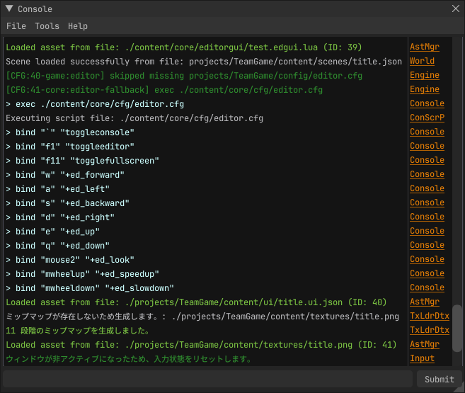

# **開発者コンソール**

コンソールは、ログの確認やコマンドの実行など、開発やデバッグに役立つ機能を提供します。

独自の[コマンド](concommand.md)や[変数](convar.md)を定義し、コンソールからアクセスすることができます。

## 操作方法

| 操作             | 説明                                                                                                                                         |
|----------------|--------------------------------------------------------------------------------------------------------------------------------------------|
| コンソールを開く       | 「`」キーを押すとコンソールの表示/非表示を切り替えられます。                                                                                                            |
| テキストボックスにフォーカス | コンソールを開いた直後に`Tab`キーを押すと、テキストボックスにフォーカスが移動します。                                                                                              |
| コマンドの入力        | テキストボックスにコマンドを入力し、Enterや`Submitボタン`を押すとコマンドが実行されます。                                                                                        |
| チャンネルでフィルタリング  | コンソール右側のチャンネル名をクリックすると、そのチャンネルのログのみを表示できます。再度クリックするとフィルタリングが解除されます。                                                                        |
| ログのコピー         | 任意の行をクリックして選択し、`Ctrl + C`を押すと、その行のログがクリップボードにコピーされます。右クリックしてコンテキストメニューを開き、Copyを選択しても同様にログがコピーされます。CtrlやShiftを押しながらクリックすると、複数行を選択してコピーできます。 |
| ログのクリア         | `clear` コマンドを入力してEnterを押すと、コンソールのログがクリアされます。コンソールウィンドウのメニューバーにある File > Clear をクリックすると、コンソールのログがクリアされます。                                   |

## **送信**
コンソールウィンドウ下部にあるボックスがコマンド入力欄です。
入力には `コマンド` と `変数` の2種類があります。

コマンドは、特定の機能を実行するための命令です。単一で実行されることが多く、引数を取ることもあります。

## [コンソールコマンド](concommand.md)

コンソールコマンド(以下ConCommand)
は、コンソールから実行できる関数です。ConCommandを定義することで、特定の機能をコマンドとして呼び出すことができます。

## [コンソール変数](convar.md)

コンソール変数(以下ConVar)
は、コンソールからアクセスできる変数です。ConVarを定義することで、ゲームの設定や状態をコマンドラインから変更することができます。

## **ConVar Helper (WIP)**
`ConVar Helper` は、コンソールへの入力・送信をボタンとして登録できる機能です。
頻繁に使用するコマンドや変数の操作を、ワンクリックで実行できるようになります。

内臓の [toggle](built-in-con-command.md) コマンドを組み合わせることで、デバッグを効率化できます。

## **サジェスト機能 (WIP)**

コンソールには、コマンドや変数のサジェスト機能があります。コマンドや変数の一部を入力すると、候補が表示されます。

!!! danger "既知の問題"
- サジェストのポップアップがコンソールウィンドウの裏側に表示されることがあります。
- 現在曖昧検索に対応しておらず、文字列の途中を入力しても認識されません。